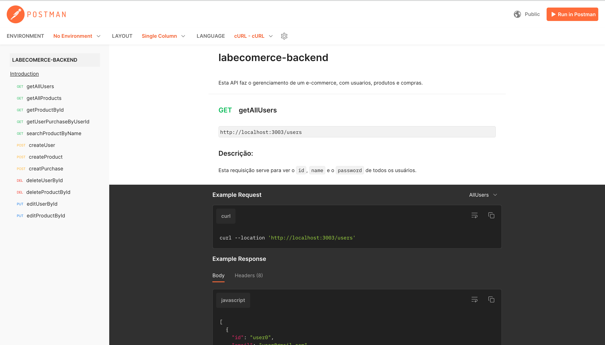

# Projeto labecommerce-backend


Meu primeiro projeto do back-end, onde pratiquei toda a base de criação de uma API vinculada a um banco de dados real.

## Índice

- [Documentação](https://github.com/LATerada/labecommerce-backend/blob/main/README.md#-documenta%C3%A7%C3%A3o)
- [Como rodar este projeto?](https://github.com/LATerada/labecommerce-backend/blob/main/README.md#-como-rodar-este-projeto)
- [Conteúdos abordados](https://github.com/LATerada/labecommerce-backend/blob/main/README.md#-conte%C3%BAdos-abordados)
- [Pessoa Autora](https://github.com/LATerada/labecommerce-backend/blob/main/README.md#%EF%B8%8F-pessoa-autora)


## 📄 Documentação

[Link demonstraçāo](https://documenter.getpostman.com/view/25826593/2s93RTPrtq)


## 📝 Como rodar este projeto?

```bash
# Clone este repositório
$ git clone linkrepo

# Acesse a pasta do projeto no seu terminal
$ cd labecommmerce-backend

# Instale as dependências
$ npm install

# Execute a aplicaçāo
$ npm run dev

# A aplicaçāo será iniciada na porta 3000, acesse pelo navegador: http://localhost:3000
```


## 📚 Conteúdos abordados

1. [NodeJS](https://nodejs.org/en)
2. [Typescript](https://www.typescriptlang.org/)
3. [Express](https://expressjs.com/pt-br/)
4. [Postman](https://www.postman.com/)


## 🙋‍♀️ Pessoa Autora

[Linkedin](https://www.linkedin.com/in/larissa-terada/)
